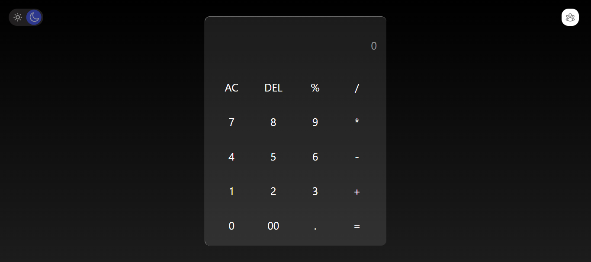

# 🧮 Simple Calculator with JavaScript & Tailwind CSS

## 📱 Features
- 🔢 **Basic Operations**: Supports addition, subtraction, multiplication, and division  
- 🧮 **Responsive Design**: Fully responsive UI optimized for desktop and mobile screens  
- 🎨 **Tailwind Styling**: Styled entirely with Tailwind CSS — no custom CSS needed  
- ⚡ **Instant Calculations**: Fast and accurate input handling with real-time output  
- 🧼 **Clear Function**: Easy reset/clear for new calculations  
- 💡 **Lightweight**: No external libraries or frameworks — pure JS + Tailwind  

---

## 🚀 Technologies Used
- HTML5  
- Tailwind 4  
- JavaScript (Vanilla)  

---

## ✨ Overview
A simple, responsive calculator built using **vanilla JavaScript** and **Tailwind CSS**.  
Designed with a clean UI and smooth user interactions, this calculator handles basic arithmetic operations and is ideal as a lightweight utility or a front-end learning project.  

This project is fully functional without any frameworks and showcases modern **utility-first styling** with Tailwind.  

---

## 👨‍🏫 Supervisor
This project was completed under the guidance of my academic supervisor:  
🔗 [Parsa Ghorbanian's Website](#)  

---

## 👥 Collaborators
| Name                | GitHub Username     | Role                |
|---------------------|--------------------|---------------------|
| Mehrab Pourzakaria  | [@mmehrab-pz](https://github.com/mmehrab-pz) | Creator & Developer |
| Parsa Deghanpour    | [@parsa-farshah](https://github.com/parsa-farshah) | Creator & Developer |

---

## 📸 Preview
 
 
 

---

## 🌐 Live Demo
Check out the live version of this calculator:  
👉 [View Demo](#)  

---

## 🔗 Connect with Me
- 🌐 [My Website](#)  
- 💼 [LinkedIn](#)  
- ✈️ [Telegram](#)  
- 📸 [Instagram](#)  

📅 **Project Date:** 2025-07-25  

---

## 🛠️ How to Use
Clone the repository:
```bash
git clone https://github.com/mmehrab-pz/Calculator-2
